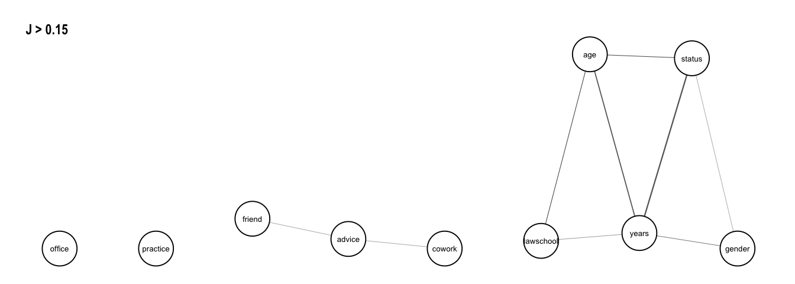
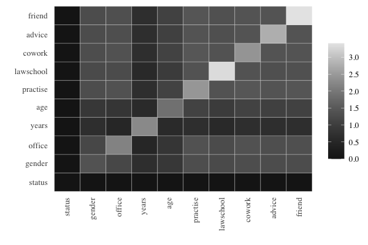

<!-- README.md is generated from README.Rmd. Please edit that file -->

# Package overview: `netropy` 

<!-- badges: start -->

[](https://cran.r-project.org/package=netropy)
<!-- badges: end -->

## Installation

<!-- You can install the released version of netropyfrom [CRAN](https://CRAN.R-project.org) with: -->
<!-- ``` r -->
<!-- install.packages("netropy") -->
<!-- ``` -->

The development version from [GitHub](https://github.com/) with:

``` r
# install.packages("devtools")
devtools::install_github("termehs/netropy")
```

## Statistical Entropy Analysis of Network Data

Multivariate entropy analysis is a general statistical method for
analyzing and finding dependence structure in data consisting of
repeated observations of variables with a common domain and with
discrete finite range spaces. Only nominal scale is required for each
variable, so only the size of the variable’s range space is important
but not its actual values. Variables on ordinal or numerical scales,
even continuous numerical scales, can be used, but they should be
aggregated so that their ranges match the number of available repeated
observations. By investigating the frequencies of occurrences of joint
variable outcomes, complicated dependence structures, partial
independence and conditional independence as well as redundancies and
functional dependence can be found.

This package introduces these entropy tools in the context of network
data. Brief description of various functions implemented in the package
are given in the following but more details are provided in the package
vignettes and the references listed.

``` r
library('netropy')
```

## Loading Internal Data

The different entropy tools are explained and illustrated by exploring
data from a network study of a corporate law firm, which has previously
been analysed by several authors
([link](https://www.stats.ox.ac.uk/~snijders/siena/Lazega_lawyers_data.htm)).
The data set is included in the package as a list with objects
representing adjacency matrices for each of the three networks advice
(directed), friendship (directed) and co-work (undirected), together
with a data frame comprising 8 attributes on each of the 71 lawyers.

To load the data, extract each object and assign the correct names to
them:

``` r
data(lawdata) 
adj.advice <- lawdata[[1]]
adj.friend <- lawdata[[2]]
adj.cowork <-lawdata[[3]]
df.att <- lawdata[[4]]
```

## Variable Domains and Data Editing

A requirement for the applicability of these entropy tools is the
specification of discrete variables with finite range spaces on the same
domain: either node attributes/vertex variables, edges/dyad variables or
triad variables. These can be either observed or transformed as shown in
the following using the above example data set.

We have 8 vertex variables with 71 observations, two of which (`years`
and `age`) are numerical and needs categorization based on their
cumulative distributions. This categorization is in details described in
the vignette “variable domains and data editing”. Here we just show the
new dataframe created (note that variable `senior` is omitted as it only
comprises unique values and that we edit all variable to start from 0):

``` r
att.var <-
  data.frame(
    status   = df.att$status-1,
    gender   = df.att$gender,
    office   = df.att$office-1,
    years    = ifelse(df.att$years <= 3,0,
                      ifelse(df.att$years <= 13,1,2)),
    age      = ifelse(df.att$age <= 35,0,
                      ifelse(df.att$age <= 45,1,2)),
    practice = df.att$practice,
    lawschool= df.att$lawschool-1
    )
head(att.var)
#>   status gender office years age practice lawschool
#> 1      0      1      0     2   2        1         0
#> 2      0      1      0     2   2        0         0
#> 3      0      1      1     1   2        1         0
#> 4      0      1      0     2   2        0         2
#> 5      0      1      1     2   2        1         1
#> 6      0      1      1     2   2        1         0
```

These vertex variables can be transformed into dyad variables by using
the function `get_dyad_var()`. Observed node attributes in the dataframe
`att_var` are then transformed into pairs of individual attributes. For
example, `status` with binary outcomes is transformed into dyads having
4 possible outcomes (0, 0), (0, 1), (1, 0), (1, 1):

``` r
dyad.status    <- get_dyad_var(att.var$status, type = 'att')
dyad.gender    <- get_dyad_var(att.var$gender, type = 'att')
dyad.office    <- get_dyad_var(att.var$office, type = 'att')
dyad.years     <- get_dyad_var(att.var$years, type = 'att')
dyad.age       <- get_dyad_var(att.var$age, type = 'att')
dyad.practice  <- get_dyad_var(att.var$practice, type = 'att')
dyad.lawschool <- get_dyad_var(att.var$lawschool, type = 'att')
```

Similarly, dyad variables can be created based on observed ties. For the
undirected edges, we use indicator variables read directly from the
adjacency matrix for the dyad in question, while for the directed ones
(`advice` and `friendship`) we have pairs of indicators representing
sending and receiving ties with 4 possible outcomes :

``` r
dyad.cwk    <- get_dyad_var(adj.cowork, type = 'tie')
dyad.adv    <- get_dyad_var(adj.advice, type = 'tie')
dyad.frn    <- get_dyad_var(adj.friend, type = 'tie')
```

All 10 dyad variables are merged into one data frame for subsequent
entropy analysis:

``` r
dyad.var <-
  data.frame(cbind(status   = dyad.status$var,
                  gender    = dyad.gender$var,
                  office    = dyad.office$var,
                  years     = dyad.years$var,
                  age       = dyad.age$var,
                  practice  = dyad.practice$var,
                  lawschool = dyad.lawschool$var,
                  cowork    = dyad.cwk$var,
                  advice    = dyad.adv$var,
                  friend    = dyad.frn$var)
                  )
head(dyad.var)
#>   status gender office years age practice lawschool cowork advice friend
#> 1      3      3      0     8   8        1         0      0      3      2
#> 2      3      3      3     5   8        3         0      0      0      0
#> 3      3      3      3     5   8        2         0      0      1      0
#> 4      3      3      0     8   8        1         6      0      1      2
#> 5      3      3      0     8   8        0         6      0      1      1
#> 6      3      3      1     7   8        1         6      0      1      1
```

A similar function `get_triad_var()` is implemented for transforming
vertex variables and different relation types into triad variables. This
is described in more detail in the vignette “variable domains and data
editing”.

## Univariate, Bivariate and Trivariate Entropies

The function `entropy_bivar()` computes the bivariate entropies of all
pairs of variables in the dataframe. The output is given as an upper
triangular matrix with cells giving the bivariate entropies of row and
column variables. The diagonal thus gives the univariate entropies for
each variable in the dataframe:

``` r
H2 <- entropy_bivar(dyad.var)
H2
#>           status gender office years   age practice lawschool cowork advice
#> status     1.493  2.868  3.640 3.370 3.912    3.453     4.363  2.092  2.687
#> gender        NA  1.547  3.758 3.939 4.274    3.506     4.439  2.158  2.785
#> office        NA     NA  2.239 4.828 4.901    4.154     5.058  2.792  3.388
#> years         NA     NA     NA 2.671 4.857    4.582     5.422  3.268  3.868
#> age           NA     NA     NA    NA 2.801    4.743     5.347  3.411  4.028
#> practice      NA     NA     NA    NA    NA    1.962     4.880  2.530  3.127
#> lawschool     NA     NA     NA    NA    NA       NA     2.953  3.567  4.186
#> cowork        NA     NA     NA    NA    NA       NA        NA  0.615  1.687
#> advice        NA     NA     NA    NA    NA       NA        NA     NA  1.248
#> friend        NA     NA     NA    NA    NA       NA        NA     NA     NA
#>           friend
#> status     2.324
#> gender     2.415
#> office     3.044
#> years      3.483
#> age        3.637
#> practice   2.831
#> lawschool  3.812
#> cowork     1.456
#> advice     1.953
#> friend     0.881
```

Bivariate entropies can be used to detect redundant variables that
should be omitted from the dataframe for further analysis. This occurs
when the univariate entropy for a variable is equal to the bivariate
entropies for pairs including that variable. As seen above, the
dataframe `dyad.var` has no redundant variables. This can also be
checked using the function `redundancy()` which yields a binary matrix
as output indicating which row and column variables are hold the same
information:

``` r
redundancy(dyad.var)
#> no redundant variables
#> NULL
```

More examples of using the function `redundancy()` is given in the
vignette “univariate bivariate and trivariate entropies”.

Trivariate entropies can be computed using the function
`entropy_trivar()` which returns a dataframe with the first three
columns representing possible triples of variables `V1`,`V2`, and `V3`
from the dataframe in question, and their entropies `H(V1,V2,V3)` as the
fourth column. We illustrated this on the dataframe `dyad.var`:

``` r
H3 <- entropy_trivar(dyad.var)
head(H3, 10) # view first 10 rows of dataframe
#>        V1     V2        V3 H(V1,V2,V3)
#> 1  status gender    office       4.938
#> 2  status gender     years       4.609
#> 3  status gender       age       5.129
#> 4  status gender  practice       4.810
#> 5  status gender lawschool       5.664
#> 6  status gender    cowork       3.464
#> 7  status gender    advice       4.048
#> 8  status gender    friend       3.685
#> 9  status office     years       5.321
#> 10 status office       age       5.721
```

## Joint Entropy and Association Graphs

Joint entropies is a non-negative measure of association among pairs of
variables. It is equal to 0 if and only if two variables are completely
independent of each other.

The function `joint_entropy()` computes the joint entropies between all
pairs of variables in a given dataframe and returns a list consisting of
the upper triangular joint entropy matrix (univariate entropies in the
diagonal) and a dataframe giving the frequency distributions of unique
joint entropy values. A function argument specifies the precision given
in number of decimals for which the frequency distribution of unique
entropy values is created (default is 3). Applying the function on the
dataframe `dyad.var` with two decimals:

``` r
J <- joint_entropy(dyad.var, 2)
J$matrix
#>           status gender office years  age practice lawschool cowork advice
#> status      1.49   0.17   0.09  0.79 0.38     0.00      0.08   0.02   0.05
#> gender        NA   1.55   0.03  0.28 0.07     0.00      0.06   0.00   0.01
#> office        NA     NA   2.24  0.08 0.14     0.05      0.13   0.06   0.10
#> years         NA     NA     NA  2.67 0.61     0.05      0.20   0.02   0.05
#> age           NA     NA     NA    NA 2.80     0.02      0.41   0.01   0.02
#> practice      NA     NA     NA    NA   NA     1.96      0.04   0.05   0.08
#> lawschool     NA     NA     NA    NA   NA       NA      2.95   0.00   0.01
#> cowork        NA     NA     NA    NA   NA       NA        NA   0.62   0.18
#> advice        NA     NA     NA    NA   NA       NA        NA     NA   1.25
#> friend        NA     NA     NA    NA   NA       NA        NA     NA     NA
#>           friend
#> status      0.05
#> gender      0.01
#> office      0.08
#> years       0.07
#> age         0.05
#> practice    0.01
#> lawschool   0.02
#> cowork      0.04
#> advice      0.18
#> friend      0.88
J$freq
#>       j  #(J = j) #(J >= j)
#> 1  0.79         1         1
#> 2  0.61         1         2
#> 3  0.41         1         3
#> 4  0.38         1         4
#> 5  0.28         1         5
#> 6   0.2         1         6
#> 7  0.18         2         8
#> 8  0.17         1         9
#> 9  0.14         1        10
#> 10 0.13         1        11
#> 11  0.1         1        12
#> 12 0.09         1        13
#> 13 0.08         4        17
#> 14 0.07         2        19
#> 15 0.06         2        21
#> 16 0.05         7        28
#> 17 0.04         2        30
#> 18 0.03         1        31
#> 19 0.02         5        36
#> 20 0.01         5        41
#> 21    0         4        45
```

As seen, the strongest association is between the variables `status` and
`years` with joint entropy values of 0.79. We have independence (joint
entropy value of 0) between two pairs of variables:
(`status`,`practice`), (`practise`,`gender`), (`cowork`,`gender`),and
(`cowork`,`lawschool`).

These results can be illustrated in a association graph using the
function `assoc_graph()` which returns a `ggraph` object in which nodes
represent variables and links represent strength of association (thicker
links indicate stronger dependence). To use the function we need to load
the `ggraph` library and to determine a threshold which the graph drawn
is based on. We set it to 0.15 so that we only visualize the strongest
associations

``` r
library(ggraph)
assoc_graph(dyad.var, 0.15)
```



Given this threshold, we see isolated and disconnected nodes
representing independent variables. We note strong dependence between
the three dyadic variables `status`,`years` and `age`, but also a
somewhat strong dependence among the three variables `lawschool`,
`years` and `age`, and the three variables `status`, `years` and
`gender`. The association graph can also be interpreted as a tendency
for relations `cowork` and `friend` to be independent conditionally on
relation `advice`, that is, any dependence between dyad variables
`cowork` and `friend` is explained by `advice`.

A threshold that gives a graph with reasonably many small independent or
conditionally independent subsets of variables can be considered to
represent a multivariate model for further testing.

More details and examples of joint entropies and association graphs are
given in the vignette “joint entropies and association graphs”.

## Prediction Power Based on Expected Conditional Entropies

The function `prediction_power()` computes prediction power when pairs
of variables in a given dataframe are used to predict a third variable
from the same dataframe. The variable to be predicted and the dataframe
in which this variable also is part of is given as input arguments, and
the output is an upper triangular matrix giving the expected conditional
entropies of pairs of row and column variables (denoted *X* and *Y*) of
the matrix, i.e. *EH(Z\|X,Y)* where *Z* is the variable to be predicted.
The diagonal gives *EH(Z\|X)* , that is when only one variable as a
predictor. Note that `NA`’s are in the row and column representing the
variable being predicted.

Assume we are interested in predicting variable `status` (that is
whether a lawyer in the data set is an associate or partner). This is
done by running the following syntax

``` r
prediction_power('status', dyad.var)
#>           status gender office years   age practice lawschool cowork advice
#> status        NA     NA     NA    NA    NA       NA        NA     NA     NA
#> gender        NA  1.375  1.180 0.670 0.855    1.304     1.225  1.306  1.263
#> office        NA     NA  2.147 0.493 0.820    1.374     1.245  1.373  1.325
#> years         NA     NA     NA 2.265 0.573    0.682     0.554  0.691  0.667
#> age           NA     NA     NA    NA 1.877    1.089     0.958  1.087  1.052
#> practice      NA     NA     NA    NA    NA    2.446     1.388  1.459  1.410
#> lawschool     NA     NA     NA    NA    NA       NA     3.335  1.390  1.337
#> cowork        NA     NA     NA    NA    NA       NA        NA  2.419  1.400
#> advice        NA     NA     NA    NA    NA       NA        NA     NA  2.781
#> friend        NA     NA     NA    NA    NA       NA        NA     NA     NA
#>           friend
#> status        NA
#> gender     1.270
#> office     1.334
#> years      0.684
#> age        1.058
#> practice   1.427
#> lawschool  1.350
#> cowork     1.411
#> advice     1.407
#> friend     3.408
```

For better readability, the powers of different predictors can be
conveniently compared by using prediction plots that display a color
matrix with rows for *X* and columns for *Y* with darker colors in the
cells when we have higher prediction power for *Z*. This is shown for
the prediction of `status`:



Obviously, the darkest color is obtained when the variable to be
predicted is included among the predictors, and the cells exhibit
prediction power for a single predictor on the diagonal and for two
predictors symmetrically outside the diagonal. Some findings are as
follows: good predictors for `status` are given by `years` in
combination with any other variable, and `age` in combination with any
other variable. The best sole predictor is `gender`.

More details and examples of expected conditional entropies and
prediction power are given in the vignette “prediction power based on
expected conditional entropies”.

## References

Parts of the theoretical background is provided in the package
vignettes, but for more details, consult the following literature:

> Frank, O., & Shafie, T. (2016). Multivariate entropy analysis of
> network data. *Bulletin of Sociological Methodology/Bulletin de
> Méthodologie Sociologique*, 129(1), 45-63.
> [link](https://doi.org/10.1177%2F0759106315615511)

> Nowicki, K., Shafie, T., & Frank, O. (Forthcoming 2022). *Statistical
> Entropy Analysis of Network Data*.
